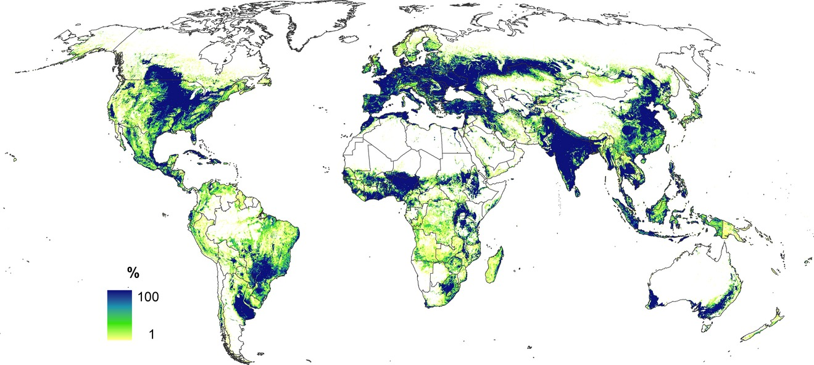
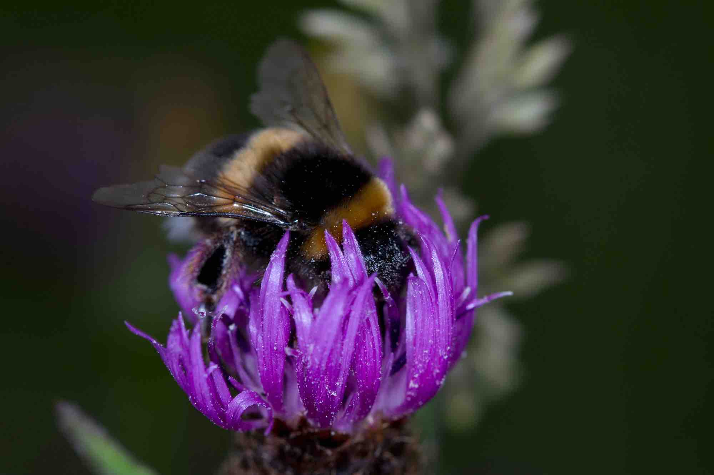
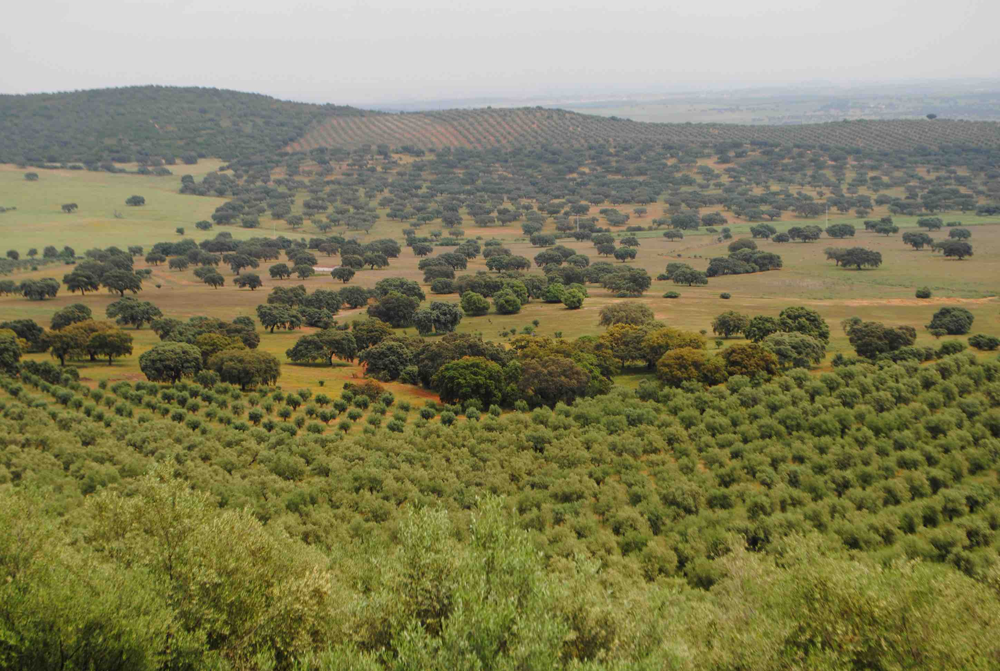

<!--Problemas y soluciones: 
1-pdf output: pdf es un poco conflictivo, os recomiendo instalar TinyTeX (https://yihui.org/tinytex/) si no teneis LaTeX instalado. Después de la instalación podreis crear archivos pdf.
2-calidad de las imagenes: el tamaño de los html es dependiente de las figuras (resolución + tamaño) y dado que en vuestro caso son imágenes externas (no creadas en R) no sé cómo disminuir su resolución para que pesen menos. Quizás este post os ayude en algo: http://zevross.com/blog/2017/06/19/tips-and-tricks-for-working-with-images-and-figures-in-r-markdown-documents/
Quizás haya modificado mucho el archivo, no sé... Quedaros con lo que os interese. Espero que sirva!-->

### Los datos: 

- Más del 40% de la superficie terrestre global está actualmente destinada a uso agrícola
- El uso de fertilizantes y agroquímicos ha aumentado en más de un 700% sólo en las últimas décadas
- Los cambios en el uso del suelo y la intensificación de las prácticas agrícolas están consideradas como los principales motores de pérdida global de biodiversidad
- Todos los grupos taxonómicos, incluyendo animales y plantas, se ven afectados por estos cambios ambientales

```{r, echo=FALSE, out.width="100%", message=FALSE, warning=FALSE, fig.cap = "Porcentage de área cultivada o cultivable en cuadrículas de 1 x 1 km. Extraído de [Fritz et al. 2015](http://onlinelibrary.wiley.com/doi/10.1111/gcb.12838/abstract)"}
library(knitr)

```

\newpage 

Conservación de la biodiversidad en sistemas agrícolas
=======================================================================

### El Problema

Actualmente, los sistemas agrícolas están considerados como uno de los mayores biomas terrestres que existen en la tierra; los llamados agroecosistemas. Innumerables especies animales y vegetales, sin embargo, se han perdido o se perderán en el futuro con la conversión del paisaje a uso agrícola y/o la intensificación de las prácticas agrícolas. Con ello, determinados procesos ecológicos que garantizan no sólo la funcionalidad de los remanentes de hábitat natural, sino también nuestro propio bienestar (los así llamados servicios ecosistémicos), se ven mermados o extinguidos. Esto convierte a los agroecosistemas en un importante escenario de conservación de la biodiversidad no sólo desde un punto de vista ecológico, sino tambien desde una perspectiva social y económica. Así, la investigación de los mecanismos que garantizan la sostenibilidad del manejo y la producción de los agroecosistemas es esencial para garantizar la producción agrícola sin poner en riesgo la biodiversidad y en definitiva nuestro propio bienestar como seres humanos.        


### Fotos

```{r, echo = FALSE, eval = TRUE, out.width="100%", fig.cap = "Muchas especies de vertebrados, como aves insectivoras, consumen grandes cantidades de insectos diariamente actuando así como efectivos controladores de plagas de cultivos (Foto: David Álvarez, CC-by)"}
knitr::include_graphics("../temps/Fig1.jpg")
```


```{r, echo = FALSE, eval = TRUE, out.width="100%",  fig.cap = "El uso de abrigos artificiales es una medida tan efectiva como sencilla para aumentar la biodiversidad dentro de los agroecosistemas (Foto: David Álvarez, CC-by)"}
knitr::include_graphics("../temps/Fig2.jpg")
```


```{r, echo = FALSE, eval = TRUE, out.width="100%",  fig.cap = "Los insectos, como los vertebrados, proporcionan una gran cantidad de servicios ecosistémicos. Entre ellos, destaca la polinización de plantas cultivadas (Foto: David Álvarez, CC-by)"}

```


```{r, echo = FALSE, eval = TRUE, out.width="100%",  fig.cap = "[El mantenimiento de áreas de vegetación natural es una de las principales estrategias usadas, aunque no la única posible, para conservar especies y procesos ecológicos con implicación directa en la producción de cultivos (Foto: Nereida Melguizo, CC-by)"}

```

\newpage 

### Citas {data-width=700}

_"Gestionar el mosaico paisajístico en su conjunto, y no sólo el hábitat natural remanente, es fundamental para conservar la biodiversidad"_  ([José M. Herrera](https://herreralab.org/), CIBIO-InBIO, herreramirlo@gmail.com
))   

_"El aporte de diferentes tipos de recursos tipos de recursos es vital para mantener una rica diversidad biológica en paisajes manejados"_  ([Javier Rodríguez-Pérez](), CIBIO-InBIO, jvr.rodriguez@gmail.com)   


### Recursos {data-width=340}

- [Grupo de Trabajo de Agroecología](http://www.aeet.org/Agroecologia_440_p.htm)  
- [Agricultura Ecológica en Europa](https://ec.europa.eu/agriculture/organic/index_es)  
- [Ted talk de Jonathan A. Foley](https://www.ted.com/talks/jonathan_foley_the_other_inconvenient_truth?language=es)  
- [Web "Ideas for Sustainability" de Joern Fischer](https://ideas4sustainability.wordpress.com/)  


