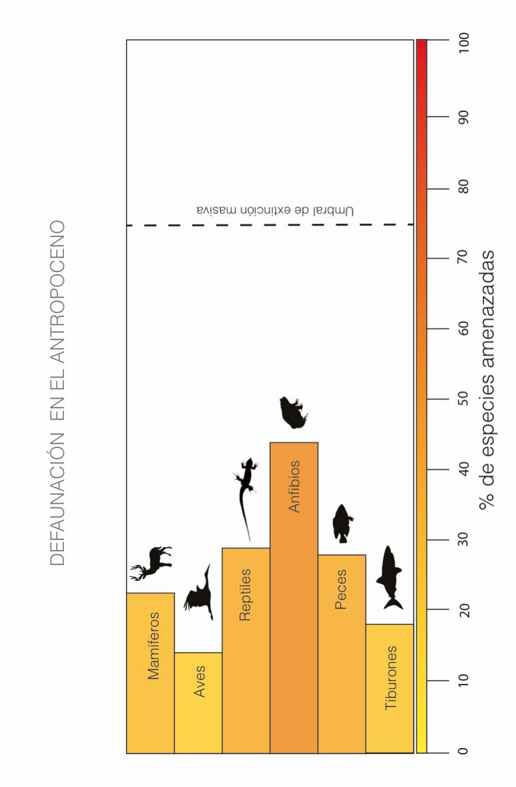

```{r setup, include=FALSE}
knitr::opts_chunk$set(echo = TRUE)
```

Sidebar {.sidebar}
=======================================================================

### Los datos: 

- Los vertebrados realizan funciones clave para el funcionamiento de los ecosistemas.
- La regeneración de los bosques, el control de plagas y enfermedades o la regulación del ciclo de nutrientes, entre otros procesos, dependen en gran medida de estos animales.  
- Al menos 338 especies se han extinguido en los últimos 500 años
- Entre un 13% - 41% (dependiendo del grupo taxonómico) de todos los vertebrados del mundo están amenazados actualmente según la IUCN (ver gráfica).
- Los vertebrados de mayor tamaño son los más vulnerables.  

```{r echo=FALSE, message=FALSE, warning=FALSE, out.width= 200, paged.print=FALSE}

```

Porcentaje de vertebrados amenazados en la actualidad según la IUCN. Gráfica: N. Pérez-Méndez


La defaunación
=======================================================================

Row
-----------------------------------------------------------------------

### El Problema
La actividad humana está provocando, directa e indirectamente, un proceso incipiente de defaunación a escala global, es decir la extinción o la reducción de las poblaciones y abundancia de un gran número de especies animales. La destrucción del hábitat, la introducción de especies invasoras y de patógenos, junto con la caza excesiva están detrás de este declive. Las especies de mayor tamaño corporal suelen ser las más vulnerables debido a varios factores: i) poseen bajas tasas reproductivas por lo que la pérdida de individuos tiene un mayor impacto que en especies que se reproducen mucho, ii) necesitan grandes áreas para sus necesidades vitales por lo que son más sensibles a la pérdida de hábitat y iii) son el objetivo principal para la caza  y el tráfico ilegal de especies. Las consecuencias de la defaunación para el funcionamiento de los ecosistemas y para los servicios que nos brindan pueden ser devastadoras. Por ejemplo, se ha observado una mayor incidencia de plagas en aquellos cultivos donde las aves o mamíferos encargados de su control han desaparecido. También se ha observado que en bosques defaunados existe una menor capacidad de almacenamiento de carbono perdiéndose así capacidad de mitigar el cambio climático. Se ha observado también una mayor frecuencia de incendios e incluso se relaciona con un incremento muy fuerte en la prevalencia de ciertas enfermedades zoonóticas. Así, y hablando sólo desde el punto de vista del bienestar humano, todo esto debería hacernos pensar en la importancia de preservar nuestra fauna y el delicado equilibrio de los ecosistemas en los que vive. 

Row
-----------------------------------------------------------------------

### Foto


### Foto


### Foto


### Foto


Row
-----------------------------------------------------------------------

### Citas {data-width=700}

_"Conservar a los vertebrados de gran tamaño es fundamental para asegurar el buen funcionamiento de los ecosistemas"_  ([Néstor Pérez-Méndez](www.nperezmendez.weebly.com), IRNAD-CONICET, nestorperezmendez@gmail.com)   

_"Nos sorprendió comprobar lo rápidamente que la deforestación causó no sólo la desaparición de la fauna sino cómo influyó en la evolución rápida de las plantas, en muy pocas generaciones"_  ([Pedro Jordano](ebd10.ebd.csic.es), Estación Biológica de Doñana, CSIC, jordano@ebd.csic.es)   


### Recursos {data-width=340}

- [El peligro de las mascotas en islas](https://vimeo.com/140250256)
- [La sexta extinción masiva](https://www.youtube.com/watch?v=z9gHuAwxwAs)
- [Entrevista al Prof. Rodolfo Dirzo sobre el fenómeno de la defaunación](http://stanfordhispanicbroadcasting.org/es/la-defaunacion-el-verdadero-estado-del-planeta-y-las-consecuencias-de-la-era-antropogenica/)
- [La extinción de grandes animales empeorará el cambio climático](https://phys.org/news/2015-12-extinction-large-animals-climate-worse.html)
- [La deforestación en Brasil induce cambios más devastadores que lo que podríamos imaginar](http://www.bbc.com/news/science-environment-22706402)


