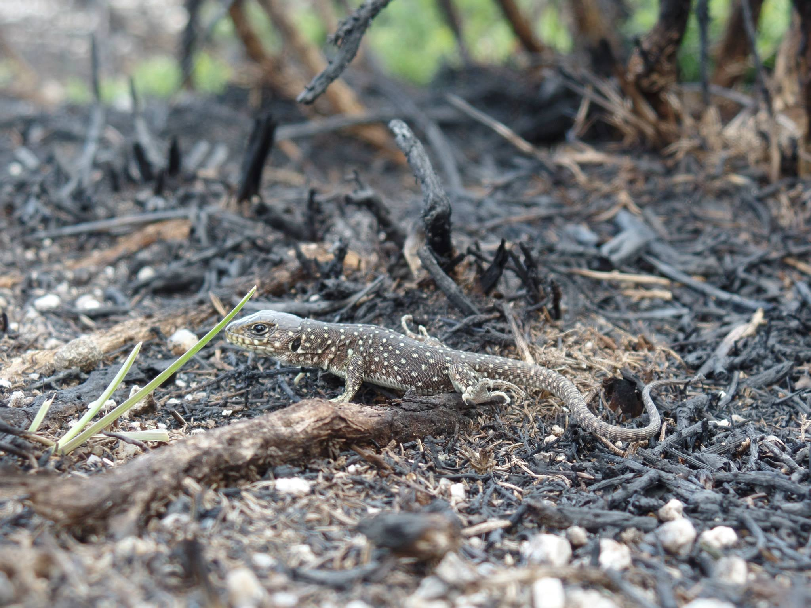

```{r setup, include=FALSE}
knitr::opts_chunk$set(echo = TRUE)
```

Sidebar {.sidebar}
=======================================================================

### Los datos: 

- En España se registran unos 13 000 siniestros anuales que afectan de media a más de 100 000 hectáreas de superficie.
- El 44% del total número de incendios y 50% del total de área ardida son en la región Noroeste (comunidades autónomas de Galicia, Asturias, Cantabria y País Vasco y las provincias de León y Zamora).
- El 96% de los siniestros están causados por actividades humanas: El 54% son intencionados y otro 26% negligencias y accidentes. Solo el 4% es causado por rayos.
- Los incendios son procesos ecológicos que, cuando ocurren con la frecuencia e intensidad con las que han ocurrido históricamente en cada ecosistema, son ecológicamente sostenibles.
- La presencia de infraestructuras humanas en el paisaje puede resultar en que los incendios, que son ecológicamente sostenibles, sean socialmente insostenibles.

Incendios
=======================================================================

Row
-----------------------------------------------------------------------

### El Problema
Los incendios son procesos naturales que han ocurrido en la naturaleza desde hace millones de años. El clima mediterráneo resulta en condiciones favorables a la ocurrencia de incendios, con un período (verano) que es simultáneamente caliente y seco. En condiciones naturales, sin intervención humana, serían principalmente rayos a provocar estos incendios. Existen regímenes de incendios ecológicamente sostenibles en que la frecuencia e intensidad están dentro de los valores históricos del ecosistema en cuestión, el régimen al que las especies y comunidades están adaptadas. De hecho, las zonas mediterráneas propensas a los incendios son zonas de elevada biodiversidad a escala mundial.

Algunos cambios, provocados por las actividades humanas, han generado desviaciones respecto a los regímenes naturales de incendios, que pueden tener consecuencias negativas para la biodiversidad y poner en peligro la estabilidad de los ecosistemas. Son ejemplo de estos cambios, el aumento del número de igniciones (en parte debido a la expansión e incorrecta planificación de la interfaz urbano-forestal), el incremento de la continuidad y conectividad espacial de la vegetación (combustible) o la proliferación y deficiente gestión de plantaciones forestales. Además, la política de extinción de incendios ha contribuido, en algunos casos, a la acumulación de vegetación (incremento del combustible disponible) y puede resultar en incendios menos frecuentes, pero más intensos. El cambio climático previsiblemente aumentará la frecuencia de condiciones favorables a la ocurrencia de incendios (alta temperatura, sequía o incluso eventos extremos como huracanes) y sus impactos negativos (p.e. la sequía puede tener efectos negativos sobre la regeneración y las lluvias torrenciales pueden incrementar la erosión).

Sin embargo, excluir el fuego de los ecosistemas mediterráneos es imposible y ecológicamente insostenible. Incluso con una gran inversión en medios de prevención y extinción, no hay forma de generar paisajes totalmente ignífugos cuando coinciden condiciones de sequía prolongada, fuertes vientos y múltiples igniciones. Además, muchas especies y comunidades requieren el fuego para su supervivencia. Eliminar el matorral para prevenir incendios o plantar árboles después de un incendio, no son siempre acciones ecológicamente sostenibles. El bosque es más que un conjunto de árboles, es un ecosistema complejo, y el hábitat de muchas especies de plantas y animales. El matorral y la vegetación que forma parte del sotobosque, son más que combustible para los incendios, tienen tanta importancia como las especies arbóreas. En primer lugar, porque albergan una enorme diversidad vegetal, incluyendo especies amenazadas, endémicas y protegidas. Además, protegen el suelo de la erosión, lo que puede tener una importancia añadida después de los incendios. Y, por último, proporcionan alimento, protección y hábitat, para varias especies animales. La solución pasa por aceptar la existencia de incendios, aprender a convivir con ellos, restaurar teniendo en cuenta que el fuego va a volver, y moldear los regímenes de incendios para que sean sostenibles, no solo desde una perspectiva socio-económica sino también para la biodiversidad.

Row
-----------------------------------------------------------------------

### Foto

.JPG)

### Foto


### Foto



### Foto

.jpg)

Row
-----------------------------------------------------------------------

### Citas {data-width=700}

_"Eliminar los incendios es imposible, antinatural y ecológicamente insostenible" ([Juli Pausas](https://www.uv.es/jgpausas/), Centro de Investigaciones sobre Desertificación, Consejo Superior de Investigaciones Científicas, juli.g.pausas@uv.es)   

_"La solución pasa por aceptar la existencia de incendios, integrar el fuego en la gestión del paisaje y gestionar los regímenes de incendios para que sean sostenibles, no solo desde una perspectiva socio-económica sino también para la biodiversidad" ([Bruno Moreira](https://sites.google.com/site/brjmoreira/), Centro de Investigaciones sobre Desertificación, Consejo Superior de Investigaciones Científicas, brjmoreira@gmail.com)   


### Recursos {data-width=340}

- [Video: "La huella del fuego", documental en "Crónicas" (La 2), TVE](http://www.rtve.es/alacarta/videos/cronicas/cronicas-huella-fuego-281116/3814720/)
- [Bases ecológicas para convivir con los incendios forestales en la Región Mediterránea](https://www.uv.es/jgpausas/papers/pausas-vallejo-2008-Ecosistemas_decalogo.pdf)
- [Fuego y evolución en el Mediterráneo](https://www.uv.es/jgpausas/papers/Pausas-2010-IyC_fuego-evolucion.pdf)
- [Decálogo de incendios forestales](http://www.paucostafoundation.org/decalogo-iiff.php)
- [Libro: Incendios Forestales. Una visión desde la ecología](https://www.uv.es/jgpausas/incendios.html)
- [Estadísticas: Información resumida de los incendios forestales en España](http://www.mapama.gob.es/es/desarrollo-rural/estadisticas/tripticoincendios-junio2015v6_tcm7-462270.pdf)

