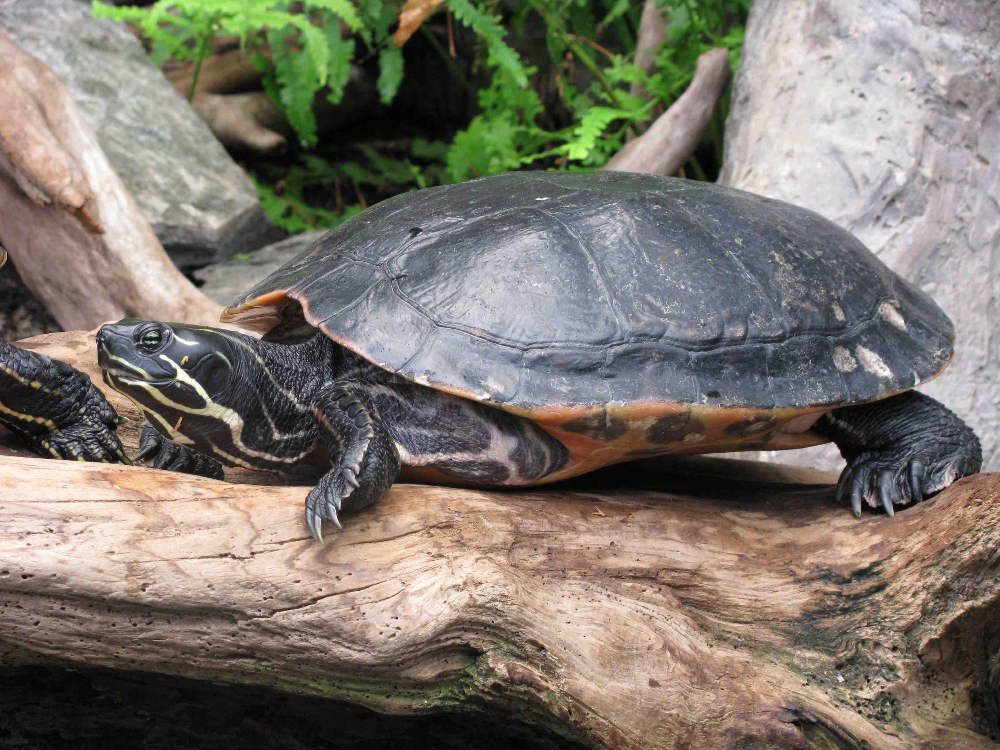
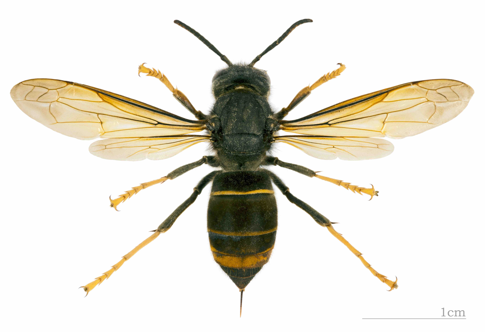

```{r setup, include=FALSE}
knitr::opts_chunk$set(echo = TRUE)
```

Sidebar {.sidebar}
=======================================================================

### Los datos: 

- Las especies invasoras están relacionadas directa o indirectamente con el 54% de las extinciones de especies y son actualmente una grave amenaza para la conservación del 27% de las especies incluidas en el Libro Rojo de la IUCN.  
- Los costes directos e indirectos de las invasiones biológicas son difíciles de cuantificar, pero se estima que suponen alrededor del 5% del PIB global.  
- Existen en la actualidad más 14 000 especies no nativas en territorio europeo, de acuerdo a las bases de datos centralizadas por EASIN ([European Alien Species Information Network](https://easin.jrc.ec.europa.eu/)).  
- Los costes ascienden a >20 millones de euros al año y no se espera que disminuyan, dado que en las últimas décadas el número de invasoras no ha dejado de crecer (76% entre 1970 y 2007).  
- En España existen unas 1500 especies no-nativas, de las cuales 180 están incluidas en el Catálogo Nacional de Especies Invasoras ([CNEEI](http://www.mapama.gob.es/)).   
- Ni tan siquiera los espacios protegidos se libran de esta amenaza. Existen al menos 180 especies no-nativas en los Parques Nacionales españoles, destacando las Islas Atlánticas de Galicia y Doñana como los parques más afectados.   

```{r iucn, echo=FALSE, fig.height=2, fig.width=2, message=FALSE, warning=FALSE}
n = 100
par(mar = c(0,0,0,0))
pie(x = c(57/n, 30/n, 7/n, 6/n) , 
    #labels = c("plantas", "insectos", "otros", "vertebrados"),
    labels = c("", "", "", "", "", ""),
    col = c("red", "orange", "yellow", "darkgreen"))
```


Un total de 180 organismos están incluidos en el Catálogo Nacional de Especies Exóticas Invasoras (CEEI). La mayoria plantas (rojo), insectos (naranja) y vertebrados (verde). Otros grupos en amarillo.

Las invasiones biológicas
=======================================================================

Row
-----------------------------------------------------------------------

### El Problema

Las especies exóticas invasoras son animales, plantas u otros organismos introducidos por el hombre en áreas lejos de su rango de distribución histórico, donde se establecen y generan un impacto negativo sobre la biodiversidad, los servicios del ecosistema o el bienestar humano. Las invasoras constituyen una de las principales causas de extinción de especies y degradación ecosistemas en el mundo. Las especies invasoras compiten y desplazan a las especies nativas, con las que pueden hibridarse con la consiguiente contaminación genética (por ejemplo entre la invasora malvasía canela, _Oxyura jamaicensis_, y la autóctona malvasía cabeciblanca, _O. leucocephala_). En ocasiones las especies invasoras depredan sobre especies nativas, como es el caso del avispón asiático ( _Vespa velutina_) y la abeja de la miel. Las especies invasoras a menudo alteran profundamente el ambiente que colonizan, hasta el punto de denominarlas “ingenieros del ecosistema”, como es el caso del mejillón cebra ( _Dreissena polymorpha_) en el río Ebro, o el camalote ( _Eichhornia crassipes_) en el Guadiana. Pero además suponen una grave amenaza para cultivos, ganado, seguridad alimentaria, nuestra salud y economía.

Row
-----------------------------------------------------------------------

### Foto


### Foto


### Foto



### Foto



Row
-----------------------------------------------------------------------

### Citas {data-width=700}

_“Frente al abrumador número de especies invasoras que amenaza la biodiversidad, la ciencia nos proporciona herramientas con las que priorizar objetivamente las especies y las regiones sobre las que actuar en primer lugar”._ [Laura Capdevila](https://www.researchgate.net/profile/Laura_Capdevila-Argueelles), GEIB, geib.uc@gmail.com   
- _“La mayoría de las especies invasoras son muy difíciles, por no decir imposibles, de erradicar, por lo que debemos de invertir nuestros mayores esfuerzos en la prevención.”_ [Montse Vilà](http://www.montsevila.org/), EBD-CSIC, montse.vila@ebd.csic.es	 
- _“Europa y España cuentan con regulaciones que ponen el énfasis en 1-la prevención 2-la detección temprana y 3-la respuesta inmediata frente a las especies invasoras. Pero todavía es necesario un mayor compromiso por parte de las administraciones competentes para hacer cumplir la legislación.”_ [Belinda Gallardo](http://www.ipe.csic.es/gallardo-armas-belinda), IPE-CSIC, belinda@ipe.csic.es   

### Recursos {data-width=340}

- [Grupo Especialista en Invasiones Biológicas](http://geibuc.wixsite.com/geib) 
- [Invasive Species Compendium](http://www.cabi.org/isc/).
- [IUCN Global Invasive Species Database](http://www.iucngisd.org/gisd/). 
- [Delivering Alien Invasive Species Inventories for Europe](http://www.europe-aliens.org).
- [European Alien Species Information Network](https://easin.jrc.ec.europa.eu/).


